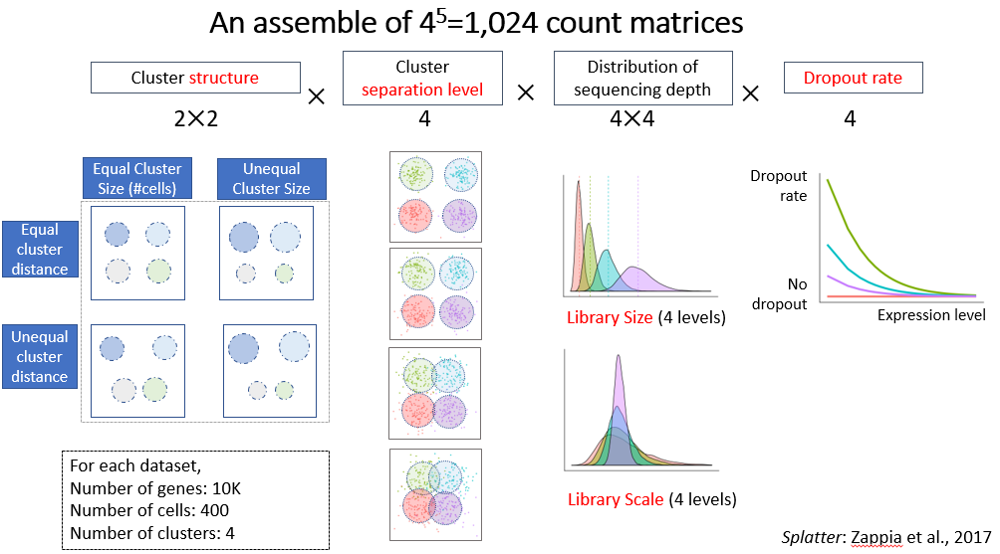
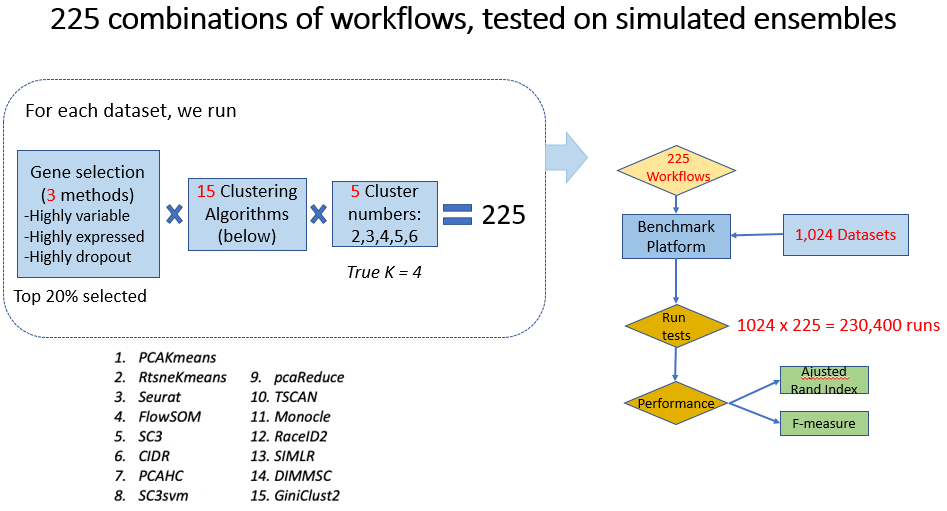

# scRNAseqBenchmark_Clustering
## Introduction
Single-cell RNA sequencing (scRNA-seq) has emerged as a powerful technology for surveying cell types and state transitions. It creates computational challenges as the data are high dimensional, low integer matrix with zero-inflation and have low-rank structures. As of early 2019, >350 tools have appeared to address >30 scRNA-seq analysis tasks. However, the community still struggles to identify the best workflow for any given task, including clustering, which is central for cell type discovery. In this study, we evaluated the performance of clustering methods using combinatorial workflows and simulated datasets covering a wide range of difficulty levels and statistical properties. 

## Overview of the study design

## Data Simulation

## Combinatorial Workflow

